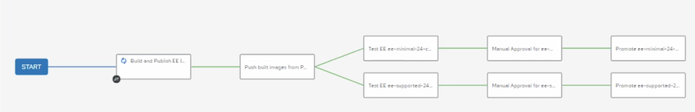

# **DRAFT: In-AAP Automated CI/CD for Ansible Execution Environments** 

This repository provides a drafted workflow for CI/CD of AAP Execution Environments (EEs) (for AAP 2.4).

## DISCLAIMER

The repository is provided “as is”, without warranty of any kind. It is likely outdated and incomplete. 

## **I. Building Execution Environments (General Concepts)**

The core of this process is the execution-environment.yml definition file, which allows you to manage the entire EE configuration as code.

### **1\. The Build Context Directory Structure**

Before running the build, you must create a directory known as the build context. ansible-builder uses the files in this directory to construct the EE image. Your custom files, such as certificates or configuration files, should be placed in a \_build subdirectory.

A typical build context looks like this:

```plaintext
ee_build_context/
├── _build/
│   ├── ansible.cfg
│   ├── pip.conf
│   └── certs/
│       ├── your_automation_hub_ca.pem
│       ├── your_company_root_ca.pem
│       └── your_company_intermediate_ca.pem
└── execution-environment.yml
```

### **2\. The execution-environment.yml Definition File**

This is the main file that defines all the components of your EE, from the base image and Ansible Collections to custom build steps for handling proxies and certificates.

```yaml
version: 3

images:
  base_image: '<your-automation-hub-fqdn>/ansible-automation-platform-24/ee-minimal-rhel8:latest'

dependencies:
  galaxy:
    collections:
      - name: containers.podman
      - name: ansible.controller
      - name: infra.ah_configuration
      - name: infra.ee_utilities
      - name: infra.controller_configuration

additional_build_steps:
  prepend_base: |
    # Remove UBI repos to use host's RHEL subscriptions
    RUN rm -f /etc/yum.repos.d/ubi.repo

    # Set proxy environment variables
    ENV HTTP_PROXY=http://<your-proxy-server>:<port>
    ENV HTTPS_PROXY=http://<your-proxy-server>:<port>
    ENV NO_PROXY="localhost, <your-internal-domain>"

    # Add pip config and CA certificates to the system trust store
    ADD _build/pip.conf /etc/pip.conf
    COPY _build/certs/ /usr/share/pki/ca-trust-source/anchors/
    RUN update-ca-trust

  prepend_builder: |
    # Set proxy for the builder stage
    ENV HTTP_PROXY=http://<your-proxy-server>:<port>
    ENV HTTPS_PROXY=http://<your-proxy-server>:<port>
    ENV NO_PROXY="localhost, <your-internal-domain>"

  prepend_galaxy: |
    # Add ansible.cfg for the galaxy install stage
    ADD _build/ansible.cfg /etc/ansible/ansible.cfg

  append_final: |
    # Clean up ansible.cfg and add pip.conf for the final runner user
    RUN rm -f /etc/ansible/ansible.cfg
    ADD _build/pip.conf /runner/.pip/pip.conf

    # Set proxy for the final runtime environment
    ENV HTTP_PROXY=http://<your-proxy-server>:<port>
    ENV HTTPS_PROXY=http://<your-proxy-server>:<port>
    ENV NO_PROXY="localhost, <your-internal-domain>"
```

### **3\. Building the Execution Environment**

Once your build context directory is prepared, navigate into it and run the ansible-builder build command. The \--tag argument specifies the name and tag for your final container image.

```bash
# Navigate into your build context directory
cd ee_build_context/

# Run the build command
ansible-builder build --tag <your-container-registry>/custom-aap-ee:1.0
```

After the build completes, you can push the image to your Private Automation Hub or another container registry.

### **4\. Detailed Configuration Explanations**

#### **Baked-in Ansible Collections**

The dependencies.galaxy.collections section lists all the Ansible Collections to be "baked into" the EE. This ensures that any automation running within this EE has these dependencies readily available, simplifying your automation projects by removing the need for a separate requirements.yml file.

#### **Python Package Management (pip.conf)**

To use an internal Python package index (like Nexus or Artifacty), you must provide a pip.conf file. The ADD \_build/pip.conf /etc/pip.conf command in the prepend\_base block places this file in a system-wide location, directing pip to use your internal repository for package installation.

**Example \_build/pip.conf:**

```ini
[global]
index = https://<your-nexus-fqdn>/repos/repository/pypi
index_url = https://<your-nexus-fqdn>/repos/repository/pypi/simple
trusted-host = <your-nexus-fqdn>
```

#### **Certificate Authority (CA) Files**

The COPY command in the prepend\_base block adds your custom Certificate Authority (CA) files to the EE's trust store. This is crucial for establishing trusted TLS communication with internal services like your Private Automation Hub, Nexus repository, or corporate proxy. The RUN update-ca-trust command makes the system recognize these new certificates.

#### **Using Host Subscriptions for RHEL Content**

The command RUN rm \-f /etc/yum.repos.d/ubi.repo is a key step for environments using a Red Hat Satellite server or Red Hat Subscription Management (RHSM). It removes the default Universal Base Image (UBI) repositories. This forces the build process to use the RHEL repositories configured on the builder host itself, allowing you to install packages from your organization's official Red Hat subscriptions.

#### **Corporate Proxy Configuration**

To function in a corporate environment, the build process and the final EE must be proxy-aware. The ENV commands set the HTTP\_PROXY, HTTPS\_PROXY, and NO\_PROXY environment variables at different stages of the build:

* **prepend\_base:** Configures the proxy for installing system packages and updating CA certificates.  
* **prepend\_builder:** Ensures the builder stage can access necessary resources.  
* **append\_final:** Sets the proxy for the final runtime environment, so any automation executed inside the EE can communicate through the proxy.

## **II. The CICD Workbench EE**

A special **"CICD Workbench EE"** is required for the CI/CD jobs themselves. This EE is used to run the playbooks that build, test, and promote the *other* EEs.

This workbench EE must contain the following collections, as seen in the example execution-environment.yml above:

* ansible.controller  
* containers.podman  
* infra.ah\_configuration  
* infra.ee\_utilities  
* infra.controller\_configuration

### **Further Resources**

For more details on creating this initial EE, refer to the following resources:

* **Execution Environment as Code (YouTube):** [https://www.youtube.com/watch?v=icvx8Bakc\_c](https://www.youtube.com/watch?v=icvx8Bakc_c)  
* **Ansible-PAH Example (GitHub):** [https://github.com/shadowman-lab/Ansible-PAH/blob/main/creation\_ee\_build.yml](https://github.com/shadowman-lab/Ansible-PAH/blob/main/creation_ee_build.yml)

## **III. Repository CI/CD Workflow**

The entire workflow is defined as code, primarily within the basic\_ee\_image\_lifecycle.yml playbook. This playbook uses the infra.controller\_configuration collection to provision all the necessary components in AAP, including:

* Projects  
* Inventories  
* Hosts  
* Job Templates  
* The Workflow Job Template itself

### **Workflow Logic**

The diagram below shows the end-to-end workflow defined in this repository.



The process flows as follows:

1. **Build and Publish EE Images:** This first job (build\_and\_publish\_ee\_images.yml) runs on the builder host. It uses ansible-builder to build the new EE versions (e.g., ee-minimal-24-custom, ee-supported-24-custom) and tags them with a unique timestamp. It then pushes these new images to the private container registry.  
2. **Push built images from PAH to AC controller:** This job (push\_built\_images\_to\_controller.yaml) runs on localhost. It takes the image information from the previous step and updates the AAP Controller.  
   * It creates/updates **"TEST"** Execution Environments (e.g., TEST Minimal EE Custom) to point to the newly-built image tags.  
   * It updates the **"Test EE..."** Job Templates to use these new "TEST" EEs for the next stage.  
3. **Test EE (Parallel):** The workflow splits into parallel branches, one for each EE being tested.  
   * The Test EE ee-minimal-24-custom job runs using the TEST Minimal EE Custom EE.  
   * The Test EE ee-supported-24-custom job runs using the TEST Supported EE Custom EE.  
   * These jobs execute playbooks (test\_ee\_minimal\_24\_custom.yaml, etc.) to validate the new EEs.  
4. **Manual Approval (Parallel):** If the test jobs succeed, the workflow pauses for manual approval. This gives an operator a chance to review the test logs and confirm the EEs are ready for promotion.  
5. **Promote EE in Controller (Parallel):** Once approved, the final job (promote\_ee\_in\_controller.yaml) runs. This job updates the *main*, production Execution Environments (e.g., Minimal EE Custom) to use the new, fully-tested image tag. At this point, any Job Template in AAP configured to use "Minimal EE Custom" will use the new version on its next run.
